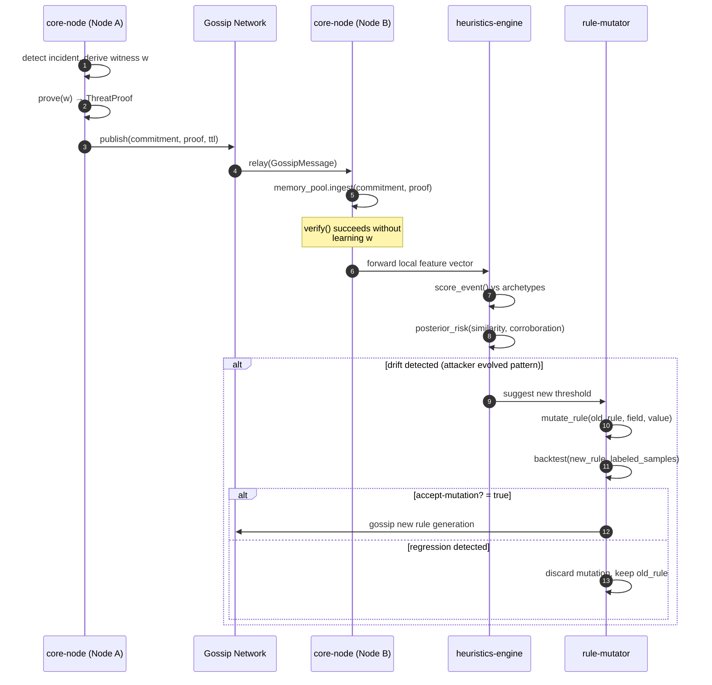
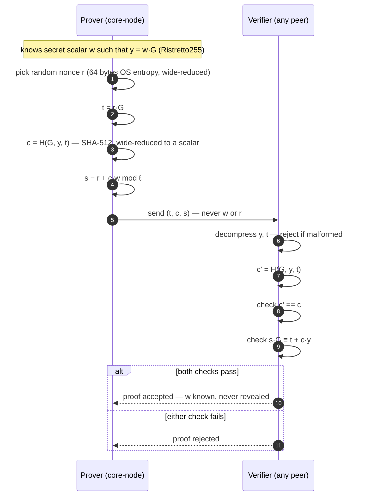
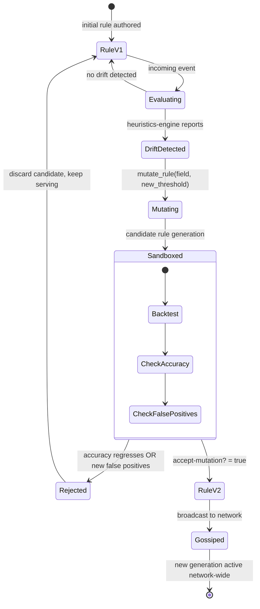
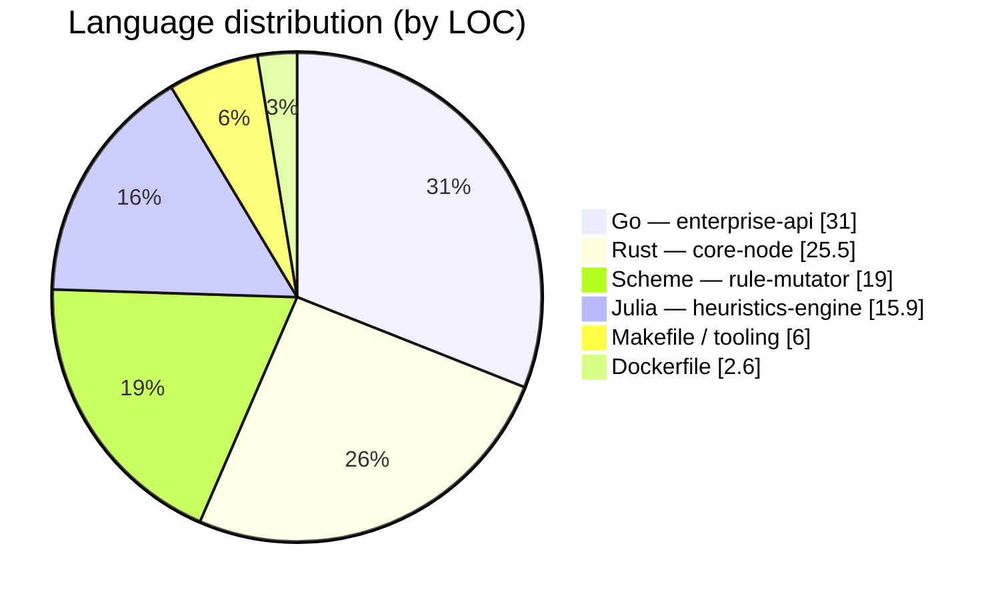

<div align="center">

# zk-threat-exchange

### Zero-Knowledge Polymorphic Threat Intelligence

*A four-language systems architecture for privacy-preserving, self-mutating threat detection*

**Ciprian Ștefan Pleșca**
Independent Researcher & Systems Architect

[](./.github/workflows/rust-tests.yml)
[](./.github/workflows/go-tests.yml)
[](./.github/workflows/julia-math-tests.yml)
[](./.github/workflows/scheme-tests.yml)
[](./.github/workflows/docker-build.yml)
[](./LICENSE)
[](./core-node)
[](./enterprise-api)
[](./heuristics-engine)
[](./rule-mutator)

</div>

---

## Abstract

Threat-intelligence sharing today forces a false choice: an organization can
either withhold evidence of an attack (protecting its own confidentiality) or
disclose it (protecting the community, at the cost of exposing internal logs,
topology, and defensive gaps). **zk-threat-exchange** removes this trade-off
by replacing raw evidence disclosure with a non-interactive zero-knowledge
proof of knowledge: a node proves *"I observed evidence consistent with
threat signature X"* without revealing the evidence itself. The published
artifact — a public commitment plus a Schnorr/Fiat-Shamir proof — carries
verifiable signal but zero exploitable information. A companion tensor-based
inference layer (Julia) scores observed events against known attack
archetypes, and a homoiconic rule-mutation engine (Scheme) allows detection
logic to rewrite itself at runtime when a statistically significant
behavioral drift is observed — subject to a mandatory regression-testing
gate before any mutation is allowed to propagate. This document describes
the architecture, the cryptographic protocol, and the engineering trade-offs
made at the current `v0.1.0` stage.

---

## Table of Contents

1. [System Overview](#1-system-overview)
2. [Architecture](#2-architecture)
3. [The Zero-Knowledge Protocol](#3-the-zero-knowledge-protocol)
4. [Self-Mutating Detection Rules](#4-self-mutating-detection-rules)
5. [Technology Stack — Rationale](#5-technology-stack--rationale)
6. [Repository Layout](#6-repository-layout)
7. [Quickstart](#7-quickstart)
8. [Enterprise Edition (Open Core)](#8-enterprise-edition-open-core)
9. [Roadmap](#9-roadmap)
10. [Known Limitations](#10-known-limitations)
11. [Documentation Index](#11-documentation-index)
12. [Publishing / Contributing](#12-publishing--contributing)
13. [Author](#13-author)

---

## 1. System Overview

```mermaid
flowchart LR
    subgraph Host["Protected Host / SOC"]
        L[("Raw incident logs")]
    end

    subgraph Core["core-node — Rust"]
        W["Witness w
        (derived locally,
        never transmitted)"]
        ZKP["ZKP Proof
        Schnorr / Fiat-Shamir"]
        Pool[("memory_pool
        verified commitments")]
    end

    subgraph Net["Gossip Network"]
        G(("P2P broadcast
        TTL-bounded"))
    end

    subgraph Infer["heuristics-engine — Julia"]
        Tensor["Feature tensor
        entropy · timing · rarity"]
        Score["Cosine similarity vs
        attack archetypes"]
        Risk["Posterior risk
        (local + corroboration)"]
    end

    subgraph Mutator["rule-mutator — Scheme"]
        Rule["Detection rule
        (s-expression AST)"]
        Sandbox{{"eval_sandbox
        backtest gate"}}
        NewRule["Rule generation N+1"]
    end

    subgraph API["enterprise-api — Go"]
        Ingest["/v1/commitments/ingest"]
        Dash["Dashboard + Billing"]
        Hook["SOC Webhook
        (Make.com)"]
    end

    L -->|"local only"| W
    W -->|"prove()"| ZKP
    ZKP -->|"public commitment"| Pool
    Pool -->|"publish()"| G
    G -->|"ingest() + verify()"| Pool
    L -.->|"feature extraction"| Tensor
    Tensor --> Score
    Pool -->|"corroboration count"| Risk
    Score --> Risk
    Risk -->|"drift detected"| Rule
    Rule --> Sandbox
    Sandbox -->|"accept-mutation? = true"| NewRule
    NewRule -.->|"gossiped"| G
    Pool --> Ingest
    Ingest --> Dash
    Dash --> Hook

    style W fill:#2d1b4e,stroke:#8b5cf6,color:#fff
    style ZKP fill:#1e3a5f,stroke:#3b82f6,color:#fff
    style Pool fill:#1e3a5f,stroke:#3b82f6,color:#fff
    style G fill:#3f2d1b,stroke:#f59e0b,color:#fff
    style Rule fill:#1b3f2d,stroke:#10b981,color:#fff
    style Sandbox fill:#1b3f2d,stroke:#10b981,color:#fff
    style NewRule fill:#1b3f2d,stroke:#10b981,color:#fff
    style Ingest fill:#3f1b2d,stroke:#ec4899,color:#fff
    style Dash fill:#3f1b2d,stroke:#ec4899,color:#fff
```



**Trust boundary, stated precisely:** raw evidence (`L`) never crosses out of
the host process. Everything that leaves `core-node` — to the gossip
network, to `heuristics-engine`, or to `enterprise-api` — is either a
zero-knowledge proof, a statistical feature vector, or an aggregate count.
No component downstream of `core-node` can reconstruct the witness `w`.

---

## 2. Architecture

### 2.1 Component responsibilities

| Component | Language | Responsibility | Never touches |
|---|---|---|---|
| `core-node` | Rust | Witness derivation, ZKP generation/verification, gossip, proof pool | — (owns the trust boundary) |
| `heuristics-engine` | Julia | Tensor scoring of event features vs. attack archetypes; posterior risk | Raw logs, witness `w` |
| `rule-mutator` | Scheme | Self-rewriting detection rules; sandboxed regression gate | Raw logs, witness `w` |
| `enterprise-api` | Go | AuthN/RBAC, billing metering, SOC integration surface | Raw logs, witness `w`, private keys |

### 2.2 Cross-node propagation



---

## 3. The Zero-Knowledge Protocol

The core primitive is a **non-interactive Schnorr proof of knowledge**,
made non-interactive via the Fiat–Shamir heuristic, running over
**Ristretto255** — a prime-order group built on Curve25519, the same
primitive family used by Signal, WireGuard, and Ed25519 (~128-bit security
against the discrete-log problem). Given the Ristretto255 base point $G$,
and a witness $w$ (a scalar) derived from local evidence:

$$
y = w \cdot G \qquad \text{(public commitment, published to the network)}
$$

**Proof generation** — the prover picks a random nonce $r$, and computes:

$$
t = r \cdot G, \qquad c = H(G, y, t), \qquad s = r + c \cdot w \pmod{\ell}
$$

where $\ell$ is the Ristretto255 group order. The output triple $(t, c, s)$
is published as canonical 32-byte encodings. Neither $w$ nor $r$ appears in
it.

**Verification** — any peer recomputes $c' = H(G, y, t)$ and checks:

$$
c' \stackrel{?}{=} c \qquad \text{and} \qquad s \cdot G \stackrel{?}{\equiv} t + c \cdot y
$$



| Property | Guarantee |
|---|---|
| **Completeness** | An honest prover who knows $w$ always convinces the verifier. |
| **Soundness** | A prover without $w$ succeeds only with probability negligible in Ristretto255's discrete-log hardness (~128-bit). |
| **Zero-knowledge** | The transcript $(t, c, s)$ is simulatable without knowledge of $w$, hence reveals nothing beyond "the prover knows $w$." |

> Full derivation, honest limitations, and the SNARK upgrade path are in
> [`docs/zero_knowledge_math.md`](./docs/zero_knowledge_math.md).

---

## 4. Self-Mutating Detection Rules

Detection rules are represented as **data** (s-expressions), not compiled
matchers — a direct consequence of Scheme's homoiconicity. "The rule
rewrites itself" is literally "a new list is produced."



Every mutation is diffable and auditable — the previous rule generation is
never modified in place, only superseded. See
[`rule-mutator/README.md`](./rule-mutator/README.md) for the predicate
vocabulary (`gt`/`lt`/`and`/`or`/`not`) and the sandbox's acceptance
criteria.

---

## 5. Technology Stack — Rationale



| Layer | Language | Why this language, specifically |
|---|---|---|
| P2P + ZKP | **Rust** | Memory safety without a GC; fearless concurrency for gossip fan-out; mature `arkworks`/`bellman`-class cryptography ecosystem for the SNARK migration path. |
| Tensor inference | **Julia** | C-like numerical performance with math-native syntax; ideal for scoring attack vectors as tensors at line rate without a Python/NumPy FFI boundary. |
| Detection rules | **Scheme** | Homoiconicity (code-as-data) makes runtime rule rewriting a first-class, auditable operation — not a plugin-reload hack. |
| Enterprise API | **Go** | Operationally boring by design: fast compilation, a single static binary, and a mature RBAC/SSO ecosystem for the customer-facing surface. |

---

## 6. Repository Layout

```
zk-threat-exchange/
├── core-node/          # Rust:   P2P gossip + ZKP circuits + in-memory proof pool
├── heuristics-engine/  # Julia:  tensor models + probabilistic threat inference
├── rule-mutator/       # Scheme: self-rewriting detection rules (macros + AST)
├── enterprise-api/     # Go:     REST SaaS layer, auth, RBAC, billing
├── deployments/        # Dockerfiles, docker-compose, Make.com blueprints
├── docs/                # architecture · zero-knowledge math · enterprise integration · roadmap
└── .github/             # CI workflows, issue/PR templates, CODEOWNERS
```

Each module directory has its own `README.md` with a component-specific
quickstart and test instructions.

---

## 7. Quickstart

Requires only Docker and Docker Compose — no cloud account needed.

```bash
git clone https://github.com/Ciprian-LocalPulse/zk-threat-exchange.git
cd zk-threat-exchange
docker-compose -f deployments/docker-compose.yml up -d
```

This starts three containers: the Rust P2P node, the Julia heuristics
engine (runs its test/inference batch), and the Go enterprise API gateway
on `localhost:8080`, in open-source/local mode — no license key required.

Running each component's native test suite:

```bash
# Rust
cd core-node && cargo fmt -- --check && cargo clippy --all-targets -- -D warnings && cargo test

# Go
cd enterprise-api && go vet ./... && go test ./...

# Scheme
cd rule-mutator/test && guile --no-auto-compile run_tests.scm

# Julia
cd heuristics-engine && julia --project=. test/runtests.jl
```

---

## 8. Enterprise Edition (Open Core)

The core protocol (`core-node`, `heuristics-engine`, `rule-mutator`) is open
source under MIT, permanently. The **Enterprise Edition** wraps it with:

- SOC integration connectors (Splunk, CrowdStrike, Microsoft Sentinel)
- Corporate SSO (SAML/OIDC) and role-based access control
- SLA-backed support
- Usage-based billing on verification volume / connected nodes

See [`docs/enterprise_integration.md`](./docs/enterprise_integration.md) for
the full model, including the billing metering implementation.

---

## 9. Roadmap

```mermaid
gantt
    title zk-threat-exchange — indicative roadmap (not calendar-committed)
    dateFormat X
    axisFormat %s

    section Phase 1 — Crypto hardening
    Production-sized group / EC migration     :p1a, 0, 3
    SNARK feasibility (Groth16 / PLONK)        :p1b, after p1a, 3
    Independent security review                :p1c, after p1b, 2

    section Phase 2 — Network transport
    libp2p / QUIC gossip transport             :p2a, after p1a, 3
    Peer discovery + transport-layer signing   :p2b, after p2a, 2

    section Phase 3 — Persistence & scale
    Persistent memory_pool + API storage       :p3a, after p2a, 3
    Load testing                                :p3b, after p3a, 2

    section Phase 4 — Enterprise readiness
    Real OIDC/SAML SSO                          :p4a, after p3a, 3
    Native SOC connectors                       :p4b, after p4a, 3

    section Phase 5 — Detection intelligence
    Trained archetype library                   :p5a, after p1b, 4
    Expanded rule-mutator predicate vocabulary  :p5b, after p5a, 2
```



Full detail in [`docs/ROADMAP.md`](./docs/ROADMAP.md).

---

## 10. Known Limitations

This project is an early-stage research/engineering scaffold. Stated
plainly, not buried:

1. ~~Cryptographic parameters are demo-scale.~~ **Resolved in v0.2.0** —
   `core-node/src/zkp/mod.rs` now runs over Ristretto255 (via
   `curve25519-dalek`), a production-grade prime-order group at ~128-bit
   security. The remaining crypto-hardening item is the SNARK migration for
   compound predicates — see
   [`docs/snark_migration_spike.md`](./docs/snark_migration_spike.md).
2. **Gossip transport is in-process**, not yet a real network layer
   (`tokio::broadcast`, not `libp2p`).
3. **The enterprise-api JWT issuer is a development stand-in** (HMAC-SHA256,
   dependency-free) — not a vetted auth library or IdP integration.

Do not deploy this in a production SOC pipeline without addressing the
above — see [`docs/ROADMAP.md`](./docs/ROADMAP.md) for the planned path.

---

## 11. Documentation Index

| Document | Contents |
|---|---|
| [`docs/architecture.md`](./docs/architecture.md) | Full data-flow diagram and trust boundaries |
| [`docs/zero_knowledge_math.md`](./docs/zero_knowledge_math.md) | ZKP protocol, proofs of properties, SNARK migration path |
| [`docs/snark_migration_spike.md`](./docs/snark_migration_spike.md) | Concrete SNARK migration design: proving system choice, circuit sketch, effort estimate |
| [`docs/enterprise_integration.md`](./docs/enterprise_integration.md) | Open-core model, auth, billing, SOC connectors |
| [`docs/ROADMAP.md`](./docs/ROADMAP.md) | Phase-by-phase plan |
| [`CHANGELOG.md`](./CHANGELOG.md) | Version history (Keep a Changelog) |
| [`CONTRIBUTING.md`](./CONTRIBUTING.md) | Contribution ground rules, test matrix |
| [`SECURITY.md`](./SECURITY.md) | Vulnerability disclosure policy |
| [`CODE_OF_CONDUCT.md`](./CODE_OF_CONDUCT.md) | Community standards |
| [`AUTHORS.md`](./AUTHORS.md) | Authorship |
| [`NOTICE`](./NOTICE) | Third-party license acknowledgements |

---

## 12. Publishing / Contributing

```bash
git add .
git commit -m "docs: academic-style README with architecture diagrams"
git push origin main
```

Contributions are welcome — see [`CONTRIBUTING.md`](./CONTRIBUTING.md) for
the ground rules (no real incident data in fixtures, mandatory sandbox
regression testing for rule-mutation changes, full test matrix before a
PR). Security issues should go through the private disclosure process in
[`SECURITY.md`](./SECURITY.md), not a public issue.

---

## 13. Author

<div align="center">

**Ciprian Ștefan Pleșca**
*Project lead, architecture, and initial implementation*

[](https://github.com/Ciprian-LocalPulse)

</div>
